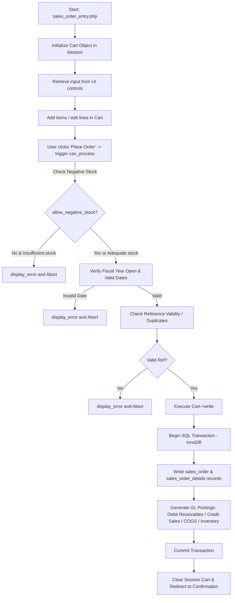

# FrontAccounting ERP (FA) — System Architecture & Deep-Dive Directory Guide

FrontAccounting (FA) is a professional, web-based, multi-user General Ledger and Enterprise Resource Planning (ERP) system designed specifically for small-to-medium enterprises (SMEs). Developed in PHP and backed by MySQL or MariaDB, it combines double-entry accounting with a friendly, document-based workflow that automates General Ledger postings in real-time.

This document serves as an exhaustive, in-depth reference for developers and system administrators. It breaks down the directory structure, module features, technical architecture, transactional workflows, and maps where all critical codebase elements reside.

---

## Table of Contents
1. [System Characteristics & Technology Stack](#1-system-characteristics--technology-stack)
2. [Exhaustive Directory Map](#2-exhaustive-directory-map)
3. [Functional Modules & Feature Sets](#3-functional-modules--feature-sets)
4. [Core Architectural Flows & Patterns](#4-core-architectural-flows--patterns)
   - [The Transaction "Cart" Flow](#the-transaction-cart-flow)
   - [Role-Based Access Control (RBAC) System](#role-based-access-control-rbac-system)
   - [Custom AJAX & UI Rendering Framework](#custom-ajax--ui-rendering-framework)
   - [Session, Session hijacking, and Brute Force Protections](#session-session-hijacking-and-brute-force-protections)
5. ["Where to Find Everything" Developer Reference](#5-where-to-find-everything-developer-reference)

---

## 1. System Characteristics & Technology Stack

*   **Backend Language:** PHP (supports PHP 5.x through PHP 7.x, with updates extending to PHP 8.x).
*   **Database Engine:** MySQL >= 4.1 or MariaDB using **InnoDB** as the required transactional storage engine to guarantee database transaction safety and rollbacks.
*   **UI/UX Paradigm:** Modular PHP-rendered forms driven by standard templates and a custom components system, supported by modern theme stylesheets and custom JavaScript for widgets.
*   **AJAX Processing:** Leverages a lightweight, highly custom AJAX transport mechanism powered by `JsHttpRequest.php` and `ajax.inc`, providing responsive page updates without bloated frameworks.
*   **Real-time Postings:** Document-level operations (Sales Invoices, Supplier Invoices, GRNs, Work Orders) automatically trigger real-time double-entry GL journal allocations.

---

## 2. Exhaustive Directory Map

At the root directory, the codebase is meticulously organized into functional ERP areas:

| Directory | Scope & Primary Responsibility | Key Files / Subdirectories |
| :--- | :--- | :--- |
| **`access/`** | Manages authentication, login screen, password resets, session timeout actions, and user authorization screens. | `login.php`, `timeout.php`, `password_reset.php` |
| **`admin/`** | Handles administrative settings including company preferences, fiscal years, POS setups, printers, backups, and role administration. | `company_preferences.php`, `security_roles.php`, `users.php`, `backups.php` |
| **`applications/`** | Defines the dashboard layout, tabs, modules, and menu categories visible upon logging in. | `application.php` (base), `customers.php`, `suppliers.php`, `generalledger.php` |
| **`company/`** | The active data vault. Contains company-specific attachments, logos, PDF templates, and dynamic extensions. | Subdirectories named after company indices (e.g. `/0/attachments/`, `/0/backup/`) |
| **`dimensions/`** | Contains files for the Project Accounting / Cost Center system (Dimensions). | `dimension_entry.php`, `inquiry/search_dimensions.php` |
| **`doc/`** | Text-based technical documentations detailing API changes, access levels, reconciliation, etc. | `access_levels.txt`, `api_changes.txt`, `license.txt` |
| **`fixed_assets/`** | Fixed Asset depreciation rules, asset transactions, classes, and asset valuations. | `process_depreciation.php`, `fixed_asset_classes.php` |
| **`gl/`** | General Ledger and Banking transactions, journal entries, account reconciliations, and budgeting. | `gl_bank.php`, `gl_journal.php`, `gl_budget.php`, `bank_account_reconcile.php` |
| **`includes/`** | Core shared libraries: DB connect wrappers, UI components, date/math helpers, security, and session management. | `session.inc`, `access_levels.inc`, `ui.inc`, `db/` (adapters), `ui/` (widgets) |
| **`install/`** | Wizard files responsible for the initial configuration and installer steps. | `install.php`, schema installers |
| **`inventory/`** | Inventory adjustments, location transfers, item setups, prices, cost revisions, and stock cards. | `transfers.php`, `adjustments.php`, `manage/items.php`, `prices.php` |
| **`js/`** | Custom JavaScript files supplying validation rules, AJAX utilities, date pickers, and search hooks. | `JsHttpRequest.js`, `date_picker.js` |
| **`lang/`** | Localization and language message catalogues. | Gettext catalog mappings |
| **`manufacturing/`**| Operations for Work Orders, Bill of Materials (BOM), manufacturing releases, and work center routers. | `work_order_entry.php`, `manage/bom_edit.php`, `manage/work_centres.php` |
| **`modules/`** | Target folder for plugins, external modules, and third-party extensions. | Dynamic module hooks |
| **`purchasing/`** | Accounts Payable operations. Purchases orders, supplier invoices, payments, allocations, and credit notes. | `po_entry_items.php`, `supplier_payment.php`, `supplier_invoice.php` |
| **`reporting/`** | Print reporting engine generating high-resolution PDF outputs, utilizing the TCPDF core. | `reports_main.php`, `/includes/pdf_report.inc`, `/fonts/` |
| **`sales/`** | Accounts Receivable operations. Sales quotes, orders, delivery dispatches, customer invoices, and allocations. | `sales_order_entry.php`, `customer_payments.php`, `credit_note_entry.php` |
| **`sql/`** | Baseline SQL schemas and reference databases with structural differences (`alter.sql`) across versions. | `en_US-new.sql` (clean db), `en_US-demo.sql` (demo data) |
| **`taxes/`** | Tax rules, groups, exemptions, and rates definitions. | `tax_types.php`, `tax_groups.php` |
| **`themes/`** | User Interface skins and CSS templates. | `/default/`, `/canvas/`, `/dropdown/` |
| **`tmp/`** | System cache folder containing temporary logs, uploaded files, and faillogs. | `faillog.php`, session buffers |

---

## 3. Functional Modules & Feature Sets

FrontAccounting features seven core application modules, represented as tabs on the top navigation bar. These are structured dynamically inside the `applications/` folder:

### 1. Sales & Customers (`applications/customers.php`)
*   **Transactions:** Entry and management of Sales Quotations, Sales Orders, Direct Delivery notes, and Direct Invoices. Offers dispatch matching ("Delivery Against Sales Orders"), billing dispatch notes ("Invoice Against Sales Delivery"), recurring invoice generation, customer payments collection, credit notes generation, and payment allocations.
*   **Inquiries & Reports:** Customer transaction searches, allocation inquiries, and multi-dimensional PDF reports (Sales Statements, Invoice Lists, Aged Account analysis).
*   **Maintenance:** Customer records, branch offices mapping, sales staff assignment, sales areas definition, credit status limits, and sales groups.

### 2. Purchases & Suppliers (`applications/suppliers.php`)
*   **Transactions:** Purchase Order entry, outstanding PO maintenance, direct Goods Received Notes (GRN) records, direct Supplier Invoice matches, Supplier Payments, and payment-to-invoice allocations.
*   **Inquiries & Reports:** Purchase order tracking, Supplier transaction histories, allocation inquiries, and purchasing statements (Aged Payables, Outstanding GRNs).
*   **Maintenance:** Comprehensive supplier ledger profiles.

### 3. Items & Inventory (`applications/inventory.php`)
*   **Transactions:** Inventory location transfers (moving stock between warehouses) and Inventory Adjustments (write-offs, stocktakes).
*   **Pricing & Costs:** Sales Pricing grids, Purchasing Pricing matrices, and Standard Cost updating (affecting inventory valuations).
*   **Inquiries & Reports:** Stock movements tracking, Item status checks, and detailed Inventory Valuation reports.
*   **Maintenance:** Stock item definition (with options for manufactured, service, or raw materials), foreign item barcodes, sales kits (assembly bundles), item categories, storage locations, and units of measure (UOM).

### 4. Fixed Assets (`applications/fixed_assets.php`)
*   **Transactions:** Fixed Asset Purchases (routing through AP invoices), Asset Location Transfers, Asset Disposal, and asset sales. Automatic calculation and posting of depreciation using Straight Line or Declining Balance methods.
*   **Maintenance:** Fixed Assets registry, depreciation categories, depreciation classes, and asset location lists.

### 5. Manufacturing (`applications/manufacturing.php`)
*   **Transactions:** Work Order entries, outstanding orders control, product assembly releases, and direct consumption adjustments.
*   **Inquiries & Reports:** Costed Bill of Materials (BOM) analyzer, "Where-Used" raw material locator, and Work Order status reports.
*   **Maintenance:** Active Bills of Materials (recipe lists) and Work Router Centres (labor hourly costing & efficiency levels).

### 6. Dimensions (`applications/dimensions.php`)
*   **Transactions:** Multi-level Dimension setups representing cost-tracking mechanisms (e.g. Departments, Projects, cost centers) which can be assigned to individual transaction lines (invoices, GL lines).
*   **Inquiries & Reports:** Profit & Loss analysis broken down by project boundaries.

### 7. Banking & General Ledger (`applications/generalledger.php`)
*   **Transactions:** Cash/Bank Payments, Bank Deposits, Bank Transfers, Account Reconciliations (matching bank statements with GL), manual Journal Entries (with debit/credit allocations), and Budget entries. Accruals processing allows spreading costs or revenues over a range of months.
*   **Inquiries & Reports:** General Ledger transaction inquiries, Trial Balances, Balance Sheet drills, Profit & Loss summaries, and Tax return forms.
*   **Maintenance:** Bank account configurations, Quick GL Entry templates, GL accounts definition (structured under custom Account Classes and Account Groups), Currencies, Exchange Rate tables, and currency revaluations.

---

## 4. Core Architectural Flows & Patterns

### The Transaction "Cart" Flow
FA uses an object-oriented Cart session approach (`/sales/includes/cart_class.inc` for sales, and equivalents for purchasing/gl) to manage multi-line transactions. 

A typical transaction process (e.g., executing a Sales Order in `/sales/sales_order_entry.php`) is processed through this flow:



#### Core validation parameters in `can_process()`:
```php
// Check if stock quantities are sufficient for non-negative stock configurations
if (!$SysPrefs->allow_negative_stock() && ($low_stock = $_SESSION['Items']->check_qoh())) {
    display_error("This document cannot be processed because there is insufficient quantity...");
    return false;
}
// Validate transaction date against active fiscal year
if (!is_date_in_fiscalyear($_POST['OrderDate'])) {
    display_error("The entered date is out of fiscal year or is closed...");
    return false;
}
// Verify uniqueness and validity of invoice/order references
if (!$Refs->is_valid($_POST['ref'], $_SESSION['Items']->trans_type)) {
    display_error("You must enter a valid reference.");
    return false;
}
```

---

### Role-Based Access Control (RBAC) System
The security layers in FA are configured in the `security_roles` database table. These settings are dynamically read at runtime during session startup (`/includes/session.inc` calling `/includes/access_levels.inc`):

1.  **Security Sections:** Categories grouped on high-level operational levels (`SS_SALES_C` Configuration, `SS_SALES` Transactions, `SS_SALES_A` Reports).
2.  **Security Areas:** Elementary actions mapped to string keys (e.g., `SA_SALESORDER` for entering orders, `SA_VOIDTRANSACTION` for voiding transactions).
3.  **Role Cache:** A logged-in user has their allowed security keys stored in `$_SESSION["wa_current_user"]->access`.

#### Code execution control flow:
Each page identifies its access requirement at the beginning:
```php
$page_security = 'SA_SALESORDER'; // Define target privilege
include_once($path_to_root . "/includes/session.inc");
```
During inclusion of `/includes/session.inc`, `check_page_security($page_security)` is executed:
```php
function check_page_security($page_security) {
    if (!$_SESSION["wa_current_user"]->can_access_page($page_security)) {
        echo "<center><b>" . _("The security settings on your account do not permit you to access this function") . "</b></center>";
        end_page();
        exit;
    }
}
```

---

### Custom AJAX & UI Rendering Framework
FA utilizes a highly customized server-side AJAX response parser. 

*   **Server Helpers:** `/includes/ui/ui_input.inc` provides unified wrapper functions to build HTML form inputs (e.g., `text_cells()`, `check_row()`, `date_cells()`).
*   **The AJAX Updater:** The global `$Ajax` object (defined in `/includes/ajax.inc`) intercepts requests. Calling `$Ajax->activate('target_id')` or updating control values triggers the server to transmit a JSON response block.
*   **Lightweight Transport:** The browser uses `/js/JsHttpRequest.js` to capture JSON elements and selectively swap HTML DOM elements without doing full-page reloads.

Example button generator:
```php
submit('ADD_ITEM', _("Add new"), true, _("Submit standard line"), 'default');
```
This generates a custom AJAX button `<button class="ajaxsubmit" aspect="default" ...>` handled natively by the `JsHttpRequest` listener.

---

### Session, Session Hijacking, and Brute Force Protections

FA incorporates structural mechanisms inside `/includes/session.inc` to harden security:

*   **Cookie Security Constraints:** Restricts session cookies to secure HTTPS channels (`SECURE_ONLY` constant) and marks them as HTTP-Only to counter XSS attacks.
*   **Session Hijacking Prevention:** Re-evaluates client environment variables (`REMOTE_ADDR` and `HTTP_USER_AGENT`) on each request:
    ```php
    function preventHijacking() {
        if (!isset($_SESSION['IPaddress']) || !isset($_SESSION['userAgent']))
            return false;
        if ($_SESSION['IPaddress'] != $_SERVER['REMOTE_ADDR'])
            return false;
        if ($_SESSION['userAgent'] != @$_SERVER['HTTP_USER_AGENT'])
            return false;
        return true;
    }
    ```
*   **Id Refreshing:** Generates an ongoing 5% likelihood of updating the `session_id` on every click, reducing session vulnerability windows.
*   **Brute Force Login Loggers:** Limits successive bad attempts. Suspicious actions write to `tmp/faillog.php` to temporarily freeze requests coming from host IPs after hitting maximum thresholds.

---

## 5. "Where to Find Everything" Developer Reference

This section serves as a directory layout reference sheet for direct codebase modification:

### Business Logic & Core Process Files
*   **Adding/Editing Items:** [/inventory/manage/items.php](file:///c:/Users/Lilian/OneDrive/Documents/ERP-Work/FA/inventory/manage/items.php)
*   **Processing Sales Orders/Quotes:** [/sales/sales_order_entry.php](file:///c:/Users/Lilian/OneDrive/Documents/ERP-Work/FA/sales/sales_order_entry.php)
*   **Issuing Customer Invoices:** [/sales/customer_invoice.php](file:///c:/Users/Lilian/OneDrive/Documents/ERP-Work/FA/sales/customer_invoice.php)
*   **Paying Suppliers:** [/purchasing/supplier_payment.php](file:///c:/Users/Lilian/OneDrive/Documents/ERP-Work/FA/purchasing/supplier_payment.php)
*   **Bank Account Reconciliations:** [/gl/bank_account_reconcile.php](file:///c:/Users/Lilian/OneDrive/Documents/ERP-Work/FA/gl/bank_account_reconcile.php)
*   **Voiding Transactions:** [/admin/void_transaction.php](file:///c:/Users/Lilian/OneDrive/Documents/ERP-Work/FA/admin/void_transaction.php)
*   **Executing Database Backups:** [/admin/backups.php](file:///c:/Users/Lilian/OneDrive/Documents/ERP-Work/FA/admin/backups.php)

### Database Abstraction & SQL Queries
*   **GL Posting Functions:** [/includes/db/audit_trail_db.inc](file:///c:/Users/Lilian/OneDrive/Documents/ERP-Work/FA/includes/db/audit_trail_db.inc)
*   **Sales Ledger Queries:** [/sales/includes/db/sales_db.inc](file:///c:/Users/Lilian/OneDrive/Documents/ERP-Work/FA/sales/includes/db/sales_db.inc)
*   **Core DB Adapters:** [/includes/db/connect_db_mysqli.inc](file:///c:/Users/Lilian/OneDrive/Documents/ERP-Work/FA/includes/db/connect_db_mysqli.inc)
*   **Installer Schemas:** [/sql/en_US-new.sql](file:///c:/Users/Lilian/OneDrive/Documents/ERP-Work/FA/sql/en_US-new.sql)

### UI Helpers & Widgets Library
*   **HTML Form Input Generators:** [/includes/ui/ui_input.inc](file:///c:/Users/Lilian/OneDrive/Documents/ERP-Work/FA/includes/ui/ui_input.inc)
*   **Select/Dropdown Box Lists:** [/includes/ui/ui_lists.inc](file:///c:/Users/Lilian/OneDrive/Documents/ERP-Work/FA/includes/ui/ui_lists.inc)
*   **Common Data Grids (Pager):** [/includes/db_pager.inc](file:///c:/Users/Lilian/OneDrive/Documents/ERP-Work/FA/includes/db_pager.inc)
*   **AJAX Handler Interface:** [/includes/ajax.inc](file:///c:/Users/Lilian/OneDrive/Documents/ERP-Work/FA/includes/ajax.inc)

---

This framework's architecture provides absolute integrity over double-entry accounting records, while maintaining maximum customizability through themes, languages, and pluggable extension modules.
