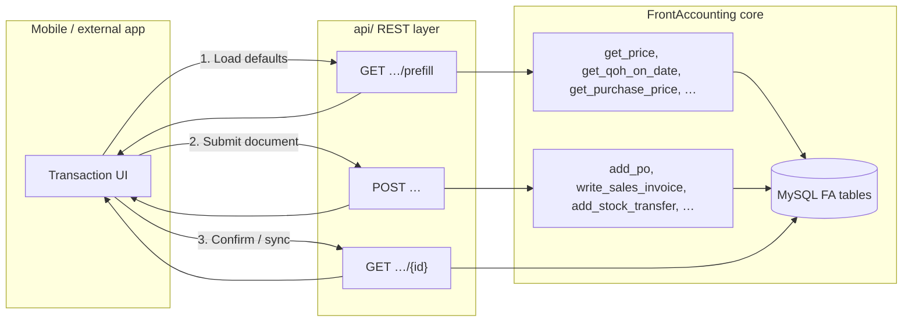
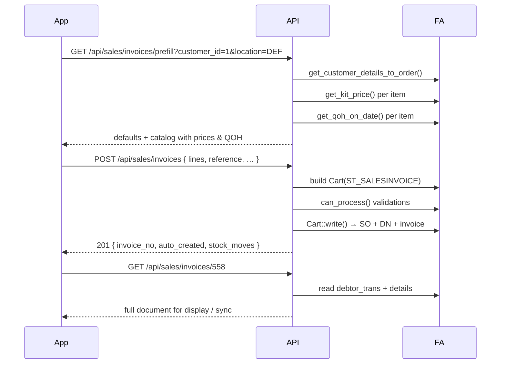

# FrontAccounting Transaction API — Design & Flow

> **Retail scope (2026-07):** Only four transaction types are routed in `api/index.php`:
> sales invoice, customer payment, supplier invoice, inventory adjustment.
> Sales orders, deliveries, purchase orders, and transfers return **404**.
> Authoritative route list: [`openapi.yaml`](openapi.yaml) and `GET /api/`.

This document describes how to build REST APIs for FrontAccounting (FA) screens. Each API follows the same **bidirectional pattern**:

1. **Prefill (read)** — resolve master data the UI needs *before* the user commits (customer-specific prices, QOH, defaults, open allocations, next reference, etc.).
2. **Commit (write)** — call the same FA write functions the PHP screens use (`add_po`, `write_sales_invoice`, …).
3. **Consume (read)** — return the persisted FA document (header, lines, GL/stock side-effects, links to related docs).

The existing AVO'Gs API (`api/`) already bootstraps FA headlessly via `api/bootstrap.php` and reads FA tables for reference data. **Phase 2** extends that layer so commits hit real FA tables (`debtor_trans`, `stock_moves`, `purch_orders`, …) instead of shadow tables like `0_avogs_sales`.

---

## Table of contents

1. [Architecture](#architecture)
2. [Shared concepts](#shared-concepts)
3. [Sales order entry](#1-sales-order--neworderyes)
4. [Sales invoice (direct)](#2-sales-invoice--newinvoice0)
5. [Delivery note (direct)](#3-delivery-note--newdelivery0)
6. [Purchase order](#4-purchase-order--neworderyes)
7. [Location transfer](#5-location-transfer--newtransfer1)
8. [Inventory adjustment](#6-inventory-adjustment--newadjustment1)
9. [Customer payment](#7-customer-payment)
10. [Proposed route map](#proposed-route-map)
11. [Implementation checklist](#implementation-checklist)

---

## Architecture



| Layer | Role |
|-------|------|
| **FA PHP screens** (`sales_order_entry.php`, …) | Session cart (`$_SESSION['Items']`, `$_SESSION['PO']`, …) + form POST |
| **FA write functions** | Single source of truth for business rules, GL, stock, tax |
| **REST API** | JSON in/out; no session cart; builds FA objects and calls write functions directly |

**Do not** POST form fields to the legacy PHP URLs from external clients. Those endpoints expect browser sessions and JsHttpRequest partial updates. The API should **reuse FA functions**, not scrape HTML.

---

## Shared concepts

### Authentication

All endpoints use the existing bearer-token auth (`POST /api/auth/login` → `Authorization: Bearer <token>`). The API runs under a dedicated FA service account configured in `api/config.php`.

### Transaction type constants (`includes/types.inc`)

| Constant | Value | Screen |
|----------|------:|--------|
| `ST_SALESINVOICE` | 10 | Direct invoice |
| `ST_CUSTPAYMENT` | 12 | Customer payment |
| `ST_CUSTDELIVERY` | 13 | Delivery note |
| `ST_LOCTRANSFER` | 16 | Location transfer |
| `ST_INVADJUST` | 17 | Inventory adjustment |
| `ST_PURCHORDER` | 18 | Purchase order |
| `ST_SALESORDER` | 30 | Sales order |

### Inventory balance (QOH)

Source of truth: **`stock_moves`** (not `loc_stock`).

```php
get_qoh_on_date($stock_id, $location, $date);          // includes/db/inventory_db.inc
check_negative_stock($stock_id, $delta_qty, $loc, $date); // pre-commit guard
```

Honour `$SysPrefs->allow_negative_stock()` — when false, delivery, invoice, transfer, and negative adjustments must pass QOH checks.

### Customer-specific sales pricing

```php
// sales/includes/sales_db.inc
get_price($stock_id, $currency, $sales_type_id, $factor, $date);
get_kit_price($item_code, $currency, $sales_type_id, $factor, $date);
```

Resolution order:

1. Exact row in `prices` for `(stock_id, customer sales_type, customer currency)`
2. Base sales type price × `sales_types.factor`
3. Home-currency price ÷ exchange rate
4. Calculated from `material_cost` × company `add_pct` preference

Customer context comes from `debtors_master` (`sales_type`, `curr_code`, `discount`) and `cust_branch` (delivery address, GL accounts).

### Supplier purchase pricing

```php
// purchasing/includes/purchasing_db.inc
get_purchase_price($supplier_id, $stock_id);  // from purch_data
```

### References

Use FA's reference engine:

```php
$Refs->get_next(ST_SALESORDER);  // etc.
check_reference($ref, ST_SALESORDER);
```

Expose next reference in prefill; validate uniqueness on commit.

### Standard error shape

```json
{
  "error": {
    "code": "validation_failed",
    "message": "Human-readable summary",
    "fields": {
      "lines[0].qty": "Insufficient stock at LOC1 on 2026-06-30"
    }
  }
}
```

HTTP status: `422` validation, `409` duplicate reference, `403` FA security area denied.

---

## 1. Sales order — `?NewOrder=Yes`

**FA screen:** `sales/sales_order_entry.php`  
**Security:** `SA_SALESORDER`  
**Write function:** `add_sales_order()` / `update_sales_order()` — `sales/includes/db/sales_order_db.inc`  
**Stock impact:** None (orders do not move inventory)

### Prefill — `GET /api/sales/orders/prefill`

**Query parameters**

| Param | Required | Description |
|-------|----------|-------------|
| `customer_id` | No | Default customer (e.g. walk-in) |
| `branch_id` | No | Defaults to customer's first branch |
| `location` | No | Stock location for QOH hints |
| `date` | No | Document date (default: today) |

**Response (example)**

```json
{
  "trans_type": 30,
  "defaults": {
    "customer_id": 1,
    "branch_id": 1,
    "sales_type": 1,
    "sales_type_name": "Retail",
    "currency": "KSh",
    "default_discount_percent": 0,
    "payment_terms": 1,
    "location": "DEF",
    "document_date": "2026-06-30",
    "delivery_date": "2026-06-30",
    "reference": "SO-2026-00042",
    "deliver_to": "Cash Customer",
    "delivery_address": "…",
    "ship_via": 1,
    "freight_cost": 0
  },
  "catalog": [
    {
      "stock_id": "AVO-001",
      "description": "Hass Avocado",
      "units": "each",
      "unit_price": 120,
      "default_discount_percent": 0,
      "qoh": 450,
      "is_kit": false,
      "mb_flag": "B"
    }
  ]
}
```

**FA functions to call**

| Data | Function / table |
|------|------------------|
| Customer defaults | `get_customer_details_to_order()` — `sales/includes/ui/sales_order_ui.inc` |
| Line prices | `get_kit_price()` per `stock_id` |
| QOH (display only) | `get_qoh_on_date($stock_id, $location, $date)` |
| Next reference | `$Refs->get_next(ST_SALESORDER)` |

### Commit — `POST /api/sales/orders`

**Request body**

```json
{
  "customer_id": 1,
  "branch_id": 1,
  "reference": "SO-2026-00042",
  "document_date": "2026-06-30",
  "delivery_date": "2026-06-30",
  "location": "DEF",
  "payment_terms": 1,
  "freight_cost": 0,
  "comments": "",
  "deliver_to": "Cash Customer",
  "delivery_address": "Nairobi",
  "ship_via": 1,
  "cust_ref": "",
  "prep_amount": 0,
  "lines": [
    {
      "stock_id": "AVO-001",
      "quantity": 10,
      "unit_price": 120,
      "discount_percent": 0,
      "description": ""
    }
  ]
}
```

**Implementation sketch**

1. Build a `Cart` (`sales/includes/cart_class.inc`) with `trans_type = ST_SALESORDER`.
2. Populate header from request; call `set_customer()`, `set_sales_type()`, `set_location()`.
3. For each line: `add_to_cart($stock_id, $qty, $price, $discount, $desc)`.
4. Run the same validations as `can_process()` in `sales_order_entry.php`.
5. `$cart->write(1)` or call `add_sales_order($cart)` directly.

**Response — `201 Created`**

```json
{
  "order_no": 1042,
  "trans_type": 30,
  "reference": "SO-2026-00042",
  "customer_id": 1,
  "total": 1200,
  "tax": 0,
  "lines": [
    {
      "stock_id": "AVO-001",
      "quantity": 10,
      "unit_price": 120,
      "discount_percent": 0,
      "line_total": 1200
    }
  ],
  "fa_tables": {
    "header": "sales_orders",
    "details": "sales_order_details"
  }
}
```

### Consume — `GET /api/sales/orders/{order_no}`

Read back from `sales_orders` + `sales_order_details` (+ `comments`, `refs`). Include `qty_sent` per line for fulfilment tracking.

---

## 2. Sales invoice — `?NewInvoice=0`

**FA screen:** `sales/sales_order_entry.php` (direct invoice)  
**Security:** `SA_SALESINVOICE`  
**Write function:** `write_sales_invoice()` — `sales/includes/db/sales_invoice_db.inc`  
**Stock impact:** Yes — direct invoice auto-creates parent **sales order** + **delivery**, then posts invoice + `stock_moves` + GL

### Document chain on direct invoice

```
POST direct invoice
  → auto sales order (ref "auto")
  → auto delivery note (stock out)
  → sales invoice (debtor_trans + GL)
  → [optional] auto customer payment if cash sale + POS
```

### Prefill — `GET /api/sales/invoices/prefill`

Same shape as sales order prefill, plus:

| Extra field | Source |
|-------------|--------|
| `due_date` | `get_invoice_duedate($payment_terms, $date)` |
| `dimension_id`, `dimension2_id` | Customer defaults |
| `pos` | `get_sales_point(user_pos())` if applicable |
| `lines[].qoh` | **Enforced** when `allow_negative_stock` is false |
| `lines[].low_stock` | `true` if `qty > qoh` |

Re-price all lines when `customer_id` or `sales_type` changes (mirror `display_order_header()` behaviour).

### Commit — `POST /api/sales/invoices`

Extends the order payload with:

```json
{
  "dimension_id": 0,
  "dimension2_id": 0,
  "lines": [
    {
      "stock_id": "AVO-001",
      "quantity": 5,
      "unit_price": 120,
      "discount_percent": 0
    }
  ]
}
```

**Validations (from `can_process()` + `Cart::check_qoh()`)**

- `document_date` in open fiscal year
- At least one line
- Unique `reference`
- Currency rates exist for customer currency on document date
- For non-cash terms: `deliver_to`, `delivery_address`, valid `delivery_date`
- Stock available at `location` on `document_date` (unless negative stock allowed)

**Response**

```json
{
  "invoice_no": 558,
  "trans_type": 10,
  "reference": "INV-2026-00123",
  "auto_created": {
    "sales_order_no": 1043,
    "delivery_no": 412
  },
  "total": 600,
  "tax": 0,
  "gl_posted": true,
  "stock_moves": [
    { "stock_id": "AVO-001", "location": "DEF", "qty": -5 }
  ],
  "cash_payment_no": null
}
```

### Consume — `GET /api/sales/invoices/{invoice_no}`

Read `debtor_trans` (type 10) + `debtor_trans_details` + `trans_tax_details` + link to delivery/SO via `src_docs` / `order_` fields.

> **Note:** The current `POST /api/sales/invoices` in `SalesController.php` writes to `0_avogs_sales` only. Phase 2 replaces that with `write_sales_invoice()` as noted in the controller comment.

---

## 3. Delivery note — `?NewDelivery=0`

**FA screen:** `sales/sales_order_entry.php` (direct delivery)  
**Security:** `SA_SALESDELIVERY`  
**Write function:** `write_sales_delivery()` — `sales/includes/db/sales_delivery_db.inc`  
**Stock impact:** Yes (no AR invoice unless invoiced separately)

### Prefill — `GET /api/sales/deliveries/prefill`

Same as invoice prefill (customer, prices, **enforced QOH**).

### Commit — `POST /api/sales/deliveries`

Same body as invoice. Implementation builds `Cart` with `ST_CUSTDELIVERY`; direct delivery auto-creates parent SO then calls `write_sales_delivery($delivery, $bo_policy=1)`.

**Response**

```json
{
  "delivery_no": 413,
  "trans_type": 13,
  "reference": "DN-2026-00088",
  "auto_created": { "sales_order_no": 1044 },
  "stock_moves": [
    { "stock_id": "AVO-001", "location": "DEF", "qty": -5 }
  ]
}
```

### Consume — `GET /api/sales/deliveries/{delivery_no}`

Read `debtor_trans` (type 13) + lines + related SO; include `qty_invoiced` status per line.

### Fulfilment from existing SO (optional extension)

| URL pattern | API equivalent |
|-------------|----------------|
| `customer_delivery.php?OrderNumber=N` | `POST /api/sales/orders/{n}/deliveries` |

Loads parent order into cart with `prepare_child=true`, then commits partial or full delivery.

---

## 4. Purchase order — `?NewOrder=Yes`

**FA screen:** `purchasing/po_entry_items.php`  
**Security:** `SA_PURCHASEORDER`  
**Write function:** `add_po()` — `purchasing/includes/db/po_db.inc`  
**Stock impact:** None at PO stage (stock moves happen at GRN receive)

### Prefill — `GET /api/purchasing/orders/prefill`

**Query parameters:** `supplier_id`, `location` (receive-into), `date`

**Response (example)**

```json
{
  "trans_type": 18,
  "defaults": {
    "supplier_id": 3,
    "currency": "KSh",
    "location": "DEF",
    "document_date": "2026-06-30",
    "reference": "PO-2026-00015",
    "delivery_address": "Warehouse, Nairobi",
    "tax_included": false,
    "dimension_id": 0,
    "dimension2_id": 0
  },
  "catalog": [
    {
      "stock_id": "AVO-001",
      "description": "Hass Avocado",
      "supplier_price": 80,
      "qoh_at_location": 450,
      "units": "each"
    }
  ]
}
```

**FA functions**

| Data | Function |
|------|----------|
| Supplier defaults | `get_supplier_details_to_order()` — `purchasing/includes/db/suppliers_db.inc` |
| Line price | `get_purchase_price($supplier_id, $stock_id)` |
| QOH hint | `get_qoh_on_date($stock_id, $location, $date)` |
| Delivery address default | `locations.delivery_address` for selected location |

### Commit — `POST /api/purchasing/orders`

```json
{
  "supplier_id": 3,
  "reference": "PO-2026-00015",
  "document_date": "2026-06-30",
  "location": "DEF",
  "delivery_address": "Warehouse, Nairobi",
  "comments": "",
  "dimension_id": 0,
  "dimension2_id": 0,
  "prep_amount": 0,
  "lines": [
    {
      "stock_id": "AVO-001",
      "quantity": 100,
      "unit_price": 80,
      "required_delivery_date": "2026-07-05",
      "description": ""
    }
  ]
}
```

Build `purch_order` (`purchasing/includes/po_class.inc`), validate with `can_commit()` rules from `po_entry_items.php`, call `add_po($cart)`.

**Response**

```json
{
  "order_no": 215,
  "trans_type": 18,
  "reference": "PO-2026-00015",
  "total": 8000,
  "lines": [ … ]
}
```

### Consume — `GET /api/purchasing/orders/{order_no}`

Read `purch_orders` + `purch_order_details`; include receive status (`qty_received` vs `quantity_ordered`).

---

## 5. Location transfer — `?NewTransfer=1`

**FA screen:** `inventory/transfers.php`  
**Security:** `SA_LOCATIONTRANSFER`  
**Write function:** `add_stock_transfer()` — `inventory/includes/db/items_transfer_db.inc`  
**Stock impact:** Two `stock_moves` per line (−source, +destination). No GL.

### Prefill — `GET /api/inventory/transfers/prefill`

**Query parameters:** `from_location`, `to_location`, `date`

```json
{
  "trans_type": 16,
  "defaults": {
    "from_location": "DEF",
    "to_location": "SHOP2",
    "document_date": "2026-06-30",
    "reference": "TR-2026-00007"
  },
  "locations": [
    { "code": "DEF", "name": "Main Warehouse" },
    { "code": "SHOP2", "name": "Shop 2" }
  ],
  "catalog": [
    {
      "stock_id": "AVO-001",
      "description": "Hass Avocado",
      "qoh_at_source": 450,
      "units": "each"
    }
  ]
}
```

QOH at **source** location only: `get_qoh_on_date($stock_id, $from_location, $date)`.

### Commit — `POST /api/inventory/transfers`

```json
{
  "from_location": "DEF",
  "to_location": "SHOP2",
  "reference": "TR-2026-00007",
  "document_date": "2026-06-30",
  "memo": "Morning replenishment",
  "lines": [
    { "stock_id": "AVO-001", "quantity": 50 }
  ]
}
```

**Validations**

- `from_location` ≠ `to_location`
- `document_date` in open fiscal year
- Unique reference
- `quantity > 0` per line
- `items_cart::check_qoh($from_location, $date, $reverse=true)` when negative stock disallowed

Kits: expand via `add_to_order()` in `stock_transfers_ui.inc` before commit.

**Response**

```json
{
  "transfer_no": 77,
  "trans_type": 16,
  "reference": "TR-2026-00007",
  "stock_moves": [
    { "stock_id": "AVO-001", "location": "DEF", "qty": -50 },
    { "stock_id": "AVO-001", "location": "SHOP2", "qty": 50 }
  ]
}
```

### Consume — `GET /api/inventory/transfers/{transfer_no}`

Mirror `inventory/view/view_transfer.php` data: lines grouped from paired `stock_moves`.

---

## 6. Inventory adjustment — `?NewAdjustment=1`

**FA screen:** `inventory/adjustments.php`  
**Security:** `SA_INVENTORYADJUSTMENT`  
**Write function:** `add_stock_adjustment()` — `inventory/includes/db/items_adjust_db.inc`  
**Stock impact:** Signed `stock_moves` (+ increase, − decrease) + GL via `add_gl_trans_std_cost()`

### Prefill — `GET /api/inventory/adjustments/prefill`

**Query parameters:** `location`, `date`

```json
{
  "trans_type": 17,
  "defaults": {
    "location": "DEF",
    "document_date": "2026-06-30",
    "reference": "ADJ-2026-00003"
  },
  "catalog": [
    {
      "stock_id": "AVO-001",
      "description": "Hass Avocado",
      "qoh": 450,
      "material_cost": 75,
      "units": "each"
    }
  ]
}
```

For negative adjustments, `std_cost` defaults to `stock_master.material_cost`.

### Commit — `POST /api/inventory/adjustments`

```json
{
  "location": "DEF",
  "reference": "ADJ-2026-00003",
  "document_date": "2026-06-30",
  "memo": "Stock count variance",
  "lines": [
    {
      "stock_id": "AVO-001",
      "quantity": -3,
      "standard_cost": 75
    }
  ]
}
```

| `quantity` sign | Meaning |
|-----------------|---------|
| `> 0` | Stock increase |
| `< 0` | Stock decrease (QOH check applies) |
| `= 0` | Rejected |

**Response**

```json
{
  "adjustment_no": 33,
  "trans_type": 17,
  "reference": "ADJ-2026-00003",
  "stock_moves": [
    { "stock_id": "AVO-001", "location": "DEF", "qty": -3, "standard_cost": 75 }
  ],
  "gl_posted": true
}
```

### Consume — `GET /api/inventory/adjustments/{adjustment_no}`

Include GL summary (adjustment account ↔ inventory account) as in `view_adjustment.php`.

---

## 7. Customer payment

**FA screen:** `sales/customer_payments.php`  
**Security:** `SA_SALESPAYMNT`  
**Write function:** `write_customer_payment()` + allocation `write()` — `sales/includes/db/payment_db.inc`, `includes/ui/allocation_cart.inc`  
**Stock impact:** None

### Prefill — `GET /api/sales/payments/prefill`

**Query parameters:** `customer_id`, `branch_id`, `bank_account`, `date`

```json
{
  "trans_type": 12,
  "defaults": {
    "customer_id": 5,
    "branch_id": 5,
    "currency": "KSh",
    "document_date": "2026-06-30",
    "reference": "RCP-2026-00100",
    "bank_account": 1,
    "bank_currency": "KSh",
    "dimension_id": 0,
    "dimension2_id": 0
  },
  "open_documents": [
    {
      "trans_type": 10,
      "trans_no": 558,
      "reference": "INV-2026-00123",
      "document_date": "2026-06-28",
      "due_date": "2026-07-28",
      "amount": 600,
      "allocated": 0,
      "balance": 600
    }
  ],
  "bank_accounts": [
    { "id": 1, "name": "Cash", "currency": "KSh" }
  ]
}
```

**FA functions**

| Data | Function |
|------|----------|
| Open invoices/credits | `allocation` class — `get_allocatable()` |
| Customer / branch | `get_customer_to_order()`, branch list |
| Bank accounts | `get_bank_accounts()` — `includes/banking.inc` |
| FX | `get_exchange_rate_from_home_currency()` when bank currency ≠ customer currency |

**Entry from invoice:** mirror `?SInvoice=N&Type=10&customer_id=X` by accepting optional `allocate_to` in prefill query.

### Commit — `POST /api/sales/payments`

```json
{
  "customer_id": 5,
  "branch_id": 5,
  "bank_account": 1,
  "reference": "RCP-2026-00100",
  "document_date": "2026-06-30",
  "amount": 600,
  "discount": 0,
  "bank_charge": 0,
  "bank_amount": 600,
  "memo": "M-Pesa payment",
  "allocations": [
    { "trans_type": 10, "trans_no": 558, "amount": 600 }
  ]
}
```

**Flow**

1. `write_customer_payment(0, $customer_id, $branch_id, $bank_account, $date, $ref, $amount, $discount, $memo, …)`
2. Build `allocation` object; set `allocs[]` from request; `$alloc->write()` → `cust_allocations`
3. Validate `check_allocations()` — allocated total ≤ payment amount

**Response**

```json
{
  "payment_no": 901,
  "trans_type": 12,
  "reference": "RCP-2026-00100",
  "amount": 600,
  "discount": 0,
  "allocations": [
    { "trans_type": 10, "trans_no": 558, "allocated": 600 }
  ],
  "gl_posted": true,
  "bank_trans_no": 901
}
```

### Consume — `GET /api/sales/payments/{payment_no}`

Read `debtor_trans` (type 12) + `cust_allocations` + `bank_trans` + `gl_trans` summary.

---

## Route map (retail — current)

Implemented in `api/index.php` (OpenAPI 2.3.1):

```
# Sales
GET    /api/sales/invoices/prefill
POST   /api/sales/invoices
GET    /api/sales/invoices/{id}

GET    /api/sales/payments/prefill
POST   /api/sales/payments
GET    /api/sales/payments/{id}

# Purchasing
GET    /api/purchasing/invoices/prefill
POST   /api/purchasing/invoices
GET    /api/purchasing/invoices/{id}

# Inventory
GET    /api/inventory/adjustments/prefill
POST   /api/inventory/adjustments
GET    /api/inventory/adjustments/{id}

# Master data (read-only)
GET    /api/customers, /suppliers, /items, /sales-types
GET    /api/prices, /purchasing-data
GET    /api/customers/{id}/prices, /suppliers/{id}/prices
GET    /api/items/{stock_id}/context
```

**Removed (404):** `/sales/orders/*`, `/sales/deliveries/*`, `/purchasing/orders/*`, `/inventory/transfers/*`

| Old call | Retail replacement |
|----------|-------------------|
| `GET /sales/orders/prefill` | `GET /sales/invoices/prefill` |
| `GET /purchasing/orders/prefill` | `GET /purchasing/invoices/prefill` |

---

## Route map (historical — B2B / full FA)

The sections below document the original seven-screen design. Controllers may still exist in the repo but routes are not registered for retail:

```
# Sales (not routed)
GET    /api/sales/orders/prefill
POST   /api/sales/orders
GET    /api/sales/orders/{id}

GET    /api/sales/deliveries/prefill
POST   /api/sales/deliveries
GET    /api/sales/deliveries/{id}

# Purchasing (not routed)
GET    /api/purchasing/orders/prefill
POST   /api/purchasing/orders
GET    /api/purchasing/orders/{id}

# Inventory (not routed)
GET    /api/inventory/transfers/prefill
POST   /api/inventory/transfers
GET    /api/inventory/transfers/{id}
```

The **item context** endpoint returns price(s) and QOH in one round-trip when the client adds a line dynamically without reloading the full catalog.

---

## Implementation checklist

### Phase 1 — Shared helpers (`api/lib/FaTransaction.php`)

- [ ] `fa_include_sales()` / `fa_include_purchasing()` / `fa_include_inventory()` — lazy-load FA `.inc` files after bootstrap
- [ ] `fa_resolve_sales_line($stock_id, $customer_id, $location, $date)` → price, discount, qoh
- [ ] `fa_resolve_purchase_line($stock_id, $supplier_id, $location, $date)` → supplier price, qoh
- [ ] `fa_validate_reference($ref, $trans_type)`
- [ ] `fa_format_validation_errors($cart_or_result)` — map FA messages to JSON `fields`

### Phase 2 — Controllers (one per document type)

| Controller | Prefill | Commit | Consume |
|------------|---------|--------|---------|
| `SalesOrderController` | ✓ | `Cart` → `add_sales_order` | `sales_orders` |
| `SalesInvoiceController` | ✓ | `Cart` → `write_sales_invoice` | `debtor_trans` |
| `SalesDeliveryController` | ✓ | `Cart` → `write_sales_delivery` | `debtor_trans` |
| `PurchaseOrderController` | ✓ | `purch_order` → `add_po` | `purch_orders` |
| `TransferController` | ✓ | `items_cart` → `add_stock_transfer` | `stock_moves` |
| `AdjustmentController` | ✓ | `items_cart` → `add_stock_adjustment` | `stock_moves` + GL |
| `PaymentController` | ✓ | `write_customer_payment` + `allocation` | `debtor_trans` |

### Phase 3 — Wire existing AVO'Gs flows

- [ ] Point `POST /api/sales/invoices` at `write_sales_invoice()` (retire `0_avogs_sales` or sync both during migration)
- [ ] Point `POST /api/wastage` at negative `add_stock_adjustment()` (`FinanceController` phase-2 hook)
- [ ] Extend `GET /api/inventory` to optionally read FA `get_qoh_on_date()` instead of shift handover math

### Phase 4 — Hardening

- [ ] Idempotency key header (`Idempotency-Key`) on POST to prevent duplicate documents on retry
- [ ] Audit log line in `api/logs` with FA `trans_no` + `trans_type`
- [ ] Permission mapping: verify API user's FA role has the matching `SA_*` area
- [ ] Integration tests: commit → consume round-trip per document type

---

## Mapping: legacy URL → API

| Legacy URL | Prefill | Commit | Consume |
|------------|---------|--------|---------|
| `/sales/sales_order_entry.php?NewOrder=Yes` | `GET /api/sales/orders/prefill` | `POST /api/sales/orders` | `GET /api/sales/orders/{id}` |
| `/sales/sales_order_entry.php?NewInvoice=0` | `GET /api/sales/invoices/prefill` | `POST /api/sales/invoices` | `GET /api/sales/invoices/{id}` |
| `/sales/sales_order_entry.php?NewDelivery=0` | `GET /api/sales/deliveries/prefill` | `POST /api/sales/deliveries` | `GET /api/sales/deliveries/{id}` |
| `/purchasing/po_entry_items.php?NewOrder=Yes` | `GET /api/purchasing/orders/prefill` | `POST /api/purchasing/orders` | `GET /api/purchasing/orders/{id}` |
| `/inventory/transfers.php?NewTransfer=1` | `GET /api/inventory/transfers/prefill` | `POST /api/inventory/transfers` | `GET /api/inventory/transfers/{id}` |
| `/inventory/adjustments.php?NewAdjustment=1` | `GET /api/inventory/adjustments/prefill` | `POST /api/inventory/adjustments` | `GET /api/inventory/adjustments/{id}` |
| `/sales/customer_payments.php` | `GET /api/sales/payments/prefill` | `POST /api/sales/payments` | `GET /api/sales/payments/{id}` |

---

## Example end-to-end: direct sales invoice



---

## Key FA source files (reference)

| Concern | Path |
|---------|------|
| Sales cart | `sales/includes/cart_class.inc` |
| Sales order UI / customer load | `sales/includes/ui/sales_order_ui.inc` |
| Sales entry page | `sales/sales_order_entry.php` |
| Pricing | `sales/includes/sales_db.inc` |
| Invoice write | `sales/includes/db/sales_invoice_db.inc` |
| Delivery write | `sales/includes/db/sales_delivery_db.inc` |
| Payment write | `sales/includes/db/payment_db.inc` |
| Payment page | `sales/customer_payments.php` |
| PO class | `purchasing/includes/po_class.inc` |
| PO entry | `purchasing/po_entry_items.php` |
| PO write | `purchasing/includes/db/po_db.inc` |
| Supplier pricing | `purchasing/includes/purchasing_db.inc` |
| Transfer UI / write | `inventory/transfers.php`, `inventory/includes/db/items_transfer_db.inc` |
| Adjustment UI / write | `inventory/adjustments.php`, `inventory/includes/db/items_adjust_db.inc` |
| QOH | `includes/db/inventory_db.inc` |
| API bootstrap | `api/bootstrap.php` |

---

*Generated for the FA + AVO'Gs integration project. Extend this document as controllers are implemented.*
